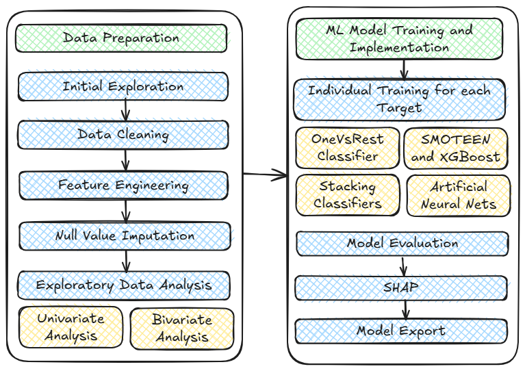

# Prediction of Toxicity using the Tox21 Dataset

This repository represents a reproducible machine learning pipeline that predicts molecular toxicity across 12 different biological targets using the [Tox21 dataset](https://tripod.nih.gov/tox21/challenge/). Each target is independently modelled as a binary classification task, with models trained on engineered descriptors, and interpreted using SHAP values for mechanistic insight. 

# Description of the Dataset.
The Tox21 dataset is a benchmark toxicology dataset jointly released by the NIH, EPA and FDA. 
It contains: 
* SMILES representations of ~8000 compounds.
* Binary activity labels, for 12 targets:
  - Nuclear Receptor Pathways: NR-AR, NR-AR-LBD, NR-AhR, NR-ER, NR-ER-LBD, NR-PPAR-γ
  - Stress Response Pathways: SR-ARE, SR-ATAD5, SR-HSE, SR-MMP, SR-p53

| Target        | Full Name                                        | Pathway Type     | Biological Relevance                                                                            |
| ------------- | ------------------------------------------------ | ---------------- | ----------------------------------------------------------------------------------------------- |
| **NR-AR**     | Androgen Receptor                                | Nuclear Receptor | Regulates development of male characteristics; key in prostate cancer and endocrine disruption. |
| **NR-AR-LBD** | Androgen Receptor Ligand Binding Domain          | Nuclear Receptor | Focuses on ligand binding effects; disruption can indicate endocrine interference.              |
| **NR-AhR**    | Aryl Hydrocarbon Receptor                        | Nuclear Receptor | Mediates xenobiotic metabolism; activated by dioxins and environmental toxins.                  |
| **NR-ER**     | Estrogen Receptor                                | Nuclear Receptor | Regulates female reproductive system; critical in breast cancer and hormonal balance.           |
| **NR-ER-LBD** | Estrogen Receptor Ligand Binding Domain          | Nuclear Receptor | Tests direct binding to ER; useful in detecting estrogenic or anti-estrogenic effects.          |
| **NR-PPAR-γ** | Peroxisome Proliferator-Activated Receptor Gamma | Nuclear Receptor | Involved in lipid metabolism, insulin sensitivity, and adipocyte differentiation.               |
| **SR-ARE**    | Antioxidant Response Element                     | Stress Response  | Measures activation of Nrf2 pathway; key in cellular defense against oxidative stress.          |
| **SR-ATAD5**  | ATPase Family AAA Domain-Containing Protein 5    | Stress Response  | Involved in DNA replication stress response; linked to genomic stability and repair.            |
| **SR-HSE**    | Heat Shock Element                               | Stress Response  | Monitors heat shock response; triggers expression of chaperone proteins under stress.           |
| **SR-MMP**    | Mitochondrial Membrane Potential                 | Stress Response  | Indicates mitochondrial integrity; disruption implies apoptosis or metabolic damage.            |
| **SR-p53**    | Tumor Protein p53                                | Stress Response  | Guardian of the genome; regulates DNA damage response, cell cycle, and apoptosis.               |


# Objectives of the Project

* Performing robust exploratory and statistical analysis of toxicity labels and molecular descriptors

* Handling missing data using appropriate imputation strategies (KNN and MICE)

* Constructing informative molecular descriptors using cheminformatics tools (e.g., RDKit)

* Training individual binary classification models for each toxicity endpoint

* Generating model explanations using SHAP to identify key drivers of toxicity

* Exporting reproducible models for deployment and future predictions

# Overview of the Pipeline


#### **Exploratory Data Analysis (EDA)**
* Visualized distribution of different molecular features and class imbalances. 

* Utilized histograms, boxplots, scatterplots and correlation matrices to analyze inter-target label relationships. 

#### **Data Cleaning and Imputation**
* Applied K-Nearest Neighbors (KNN) imputation and Multivariate Chain Equations (MICE) to address missing molecular descriptors and labels
 
* KNN imputation leverages the principle that structurally or physicochemically similar compounds tend to exhibit comparable bioactivity and toxicity profiles.

* MICE captures the inherent correlations among molecular properties (e.g., LogP, TPSA, H-bonding), aligning with how biological activity arises from the combined influence of multiple features.

* By conditioning each imputed value on all others, MICE maintains biologically plausible descriptor combinations that reflect realistic ADME behavior.

* Such entries often represent chemically atypical or non-druglike molecules and may introduce noise, undermining both model fidelity and biological insight.

#### **Feature Engineering**
* Derived descriptors from SMILES using RDKit: Molecular weight, TPSA, LogP, H-bond donors/acceptors, rotatable bonds, etc.

* Normalized and transformed of continuous features

#### **Model Development**

* Modeled each of the 12 toxicity tasks as an independent classification problem

* Used ensemble-based classifiers (Random Forest, XGBoost) with stratified sampling

* Conducted hyperparameter tuning via GridSearchCV

* Models trained using balanced class weights or SMOTE 

#### **Model Evaluation**

* Metrics: ROC-AUC, F1-score, Precision, Recall, Accuracy

* Outputs saved as classification reports and confusion matrices. 

#### **Model Explainability**

Applied SHAP (SHapley Additive exPlanations) to all models

# Dependencies: 
```
pip install -r requirements.txt
``` 

# Future Work 
* Extend to multi-label architectures

* Integrate graph-based molecular encodings (e.g., GNNs)

* Compare performance against deep learning baselines

* Publish models via web API or Streamlit
